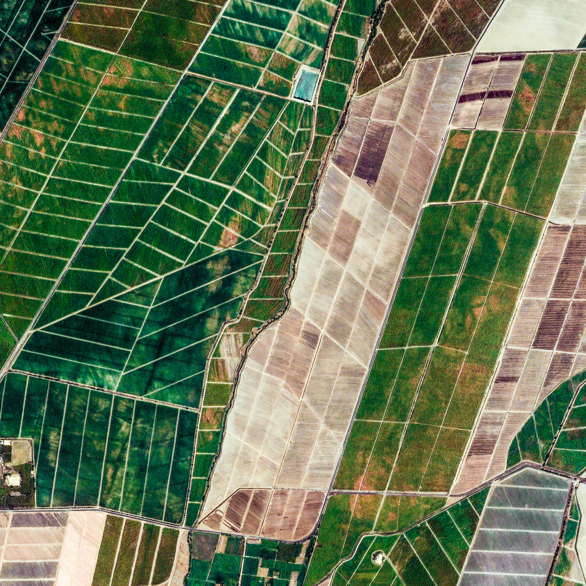
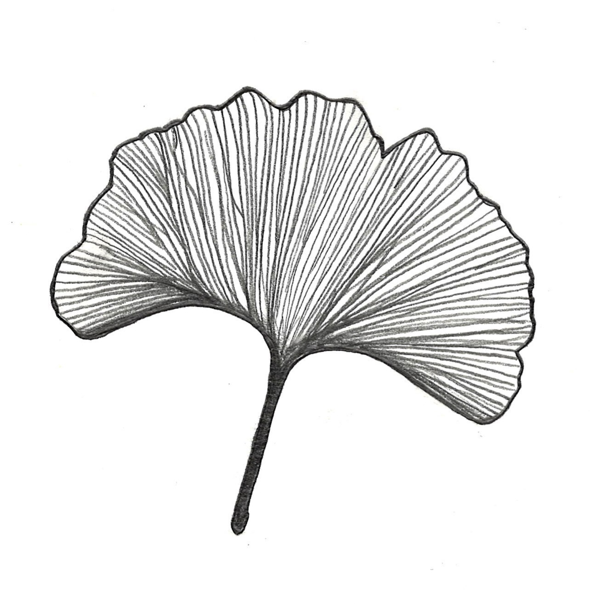
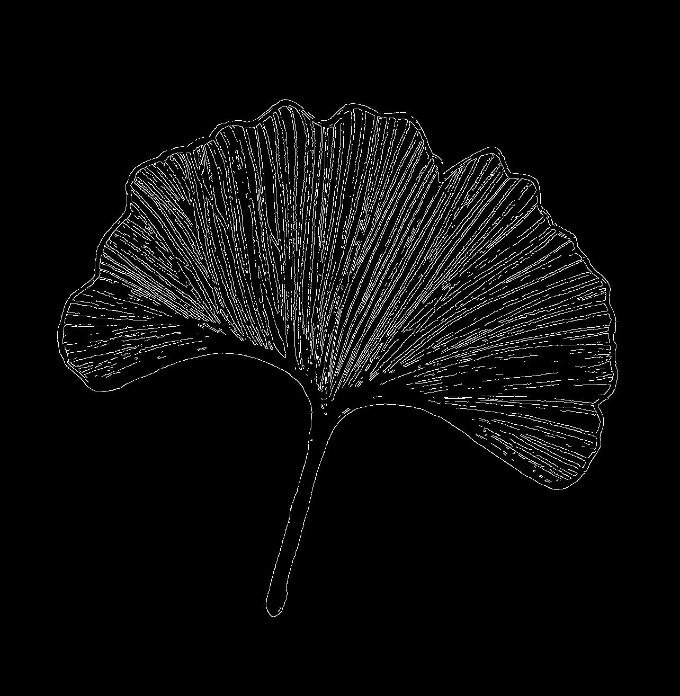
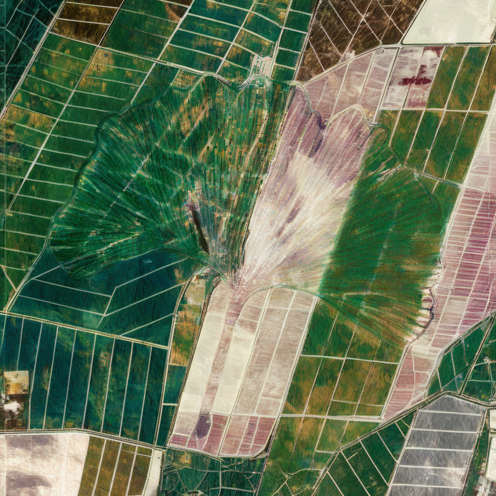

# Emergent Image

Emergent Image allows you to create a video in which an image emerges from the frames of the video. It does this using Stable Diffusions img2img method and with a ControlNet to apply the outline of the emerging image. 

The INPUT is a video or folder of images which form the bakground of the video.

The CONTROL is an image, video, or folder of images in which the outline of the forms emerge from the background frames provided in INPUT. 

Example of combining two still images:

   
  <em>Background</em>
  

   
  <!--   -->
  <em>Control</em>

   
  <em>Result</em>

This process is applied to each frame of an input video, and parameters of the generation can change over time to increase or decrease the visibility of the control image. The control image can also be a video! 
